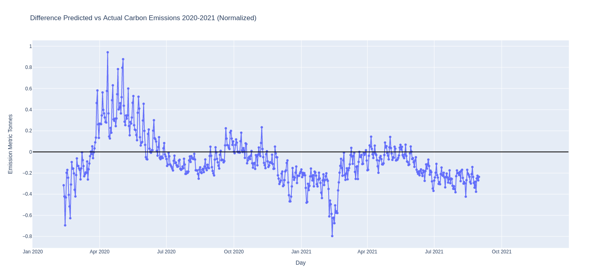
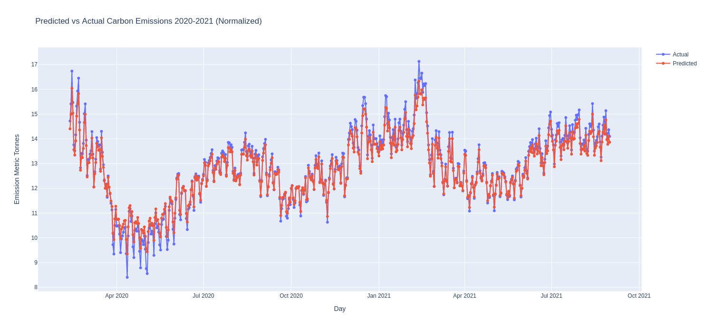

# Carbon - Metrics - Model
## Investigation Of Covid’s Impact On Carbon Emission Rates In the United States  

 

 
 

# Problem Description and Research Question

In our project, we want to explore the question, **how can we use models to predict whether COVID-19 decreased, increased, or had little effect on carbon emissions in the United States?** Ultimately, we will have a graph that shows the differences between the actual emissions vs. our predicted emissions to draw conclusions for our research question.

----

## **Our Team**: [Eric Karpovits](https://github.com/EricKarpovits), [Ahmed Khalf](https://github.com/ahmedkhalf), Rohan Mistry Eric Karpovits, and Shaffaan Bin Aamir

----

## [**Our Project Report**](https://github.com/EricKarpovits/Carbon-Metrics-Model/blob/main/project_report.pdf)

## **How to run the project?** 

Within the project directory,

    1. Python install all the required python libraries and packages found in "requirements.txt".
    2. For your convenience, we have created an automatic system that downloads all required files with proper naming in the current directory. All you need to do is run the main.py file and both the data sets and pre-trained models will be downloaded automatically.
    3. When you run the main.py file, apart from downloading the data sets and models, you should expect to see a Tkinter window. When you click on one of the buttons in the Tkinter window, you should expect a browser tab to open which will contain the Plotly plot.

## **Some of our results:**

